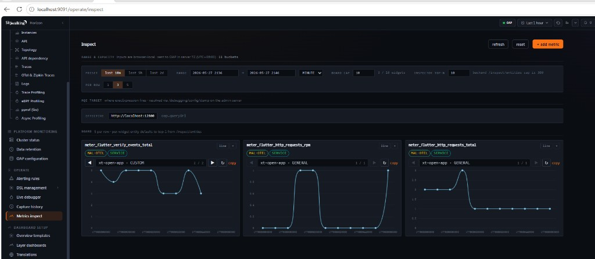
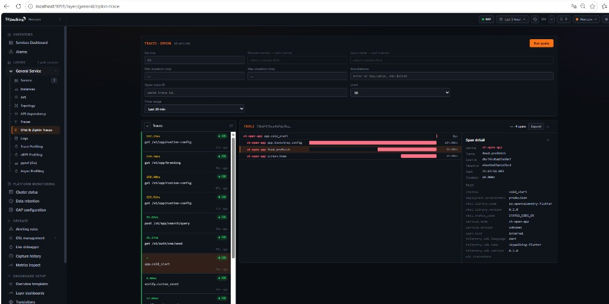
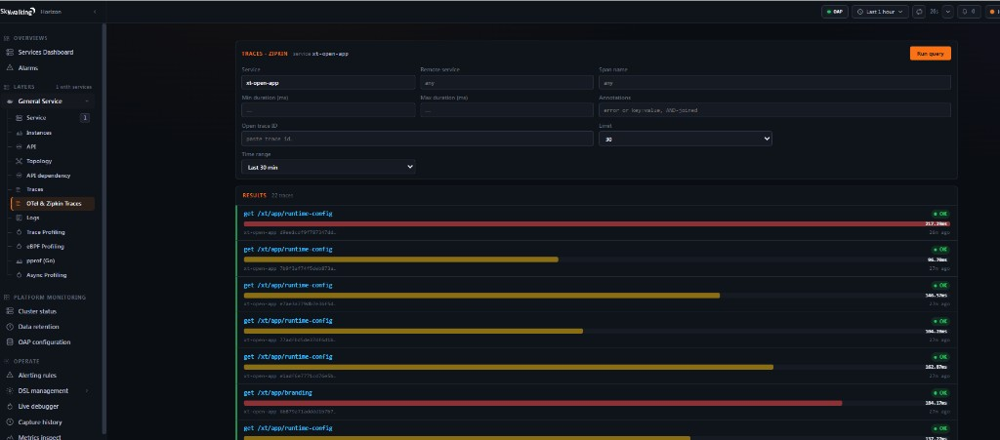
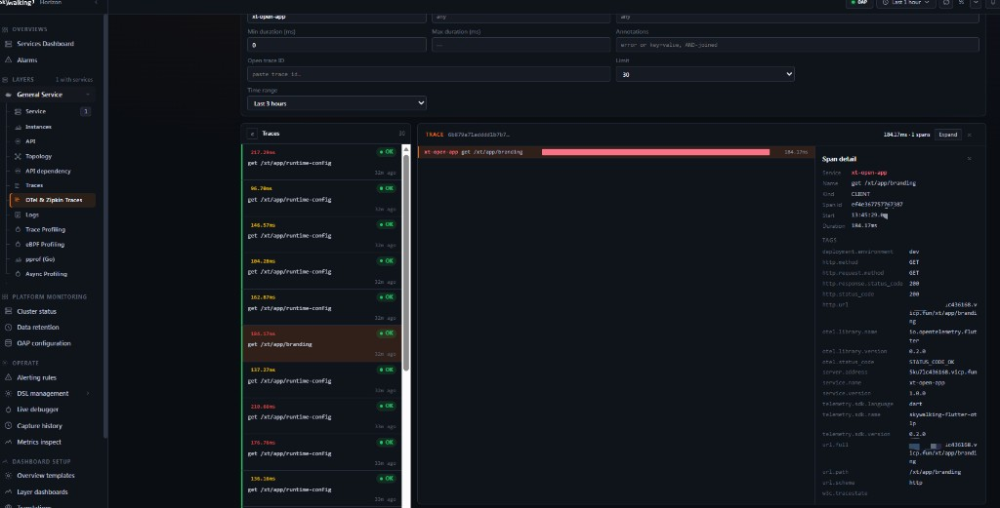

# skywalking_flutter

<div align="right">

[](README.md)
[](doc/USAGE.md)

</div>

[](https://pub.dev/packages/skywalking_flutter)
[](https://github.com/songzhendong/skywalking-flutter)
[](LICENSE)

OpenTelemetry **OTLP/HTTP** agent for **traces** and **metrics**, compatible with [Apache SkyWalking OAP](https://skywalking.apache.org/) (`receiver-otel` on port **12800**).

Source repository: https://github.com/songzhendong/skywalking-flutter (mirror: [skywalking-dart](https://github.com/songzhendong/skywalking-dart))

| Item | Value |
|------|--------|
| pub package | `skywalking_flutter` |
| Runtime | Dart / Flutter apps |
| Protocol | `POST /v1/traces`, `POST /v1/metrics` (HTTP JSON) |
| Version | 0.1.3 |
| SDK | Dart `>=3.0.0` |

## Features

- Standard OTLP over HTTP JSON (OpenTelemetry-aligned env vars)
- `OtlpAgent` → `tracer` / `meter` / `httpClient()`
- HTTP client spans + `http.client.requests` / `http.client.request.duration`
- `OtlpFlutter.init()` reads `--dart-define` (Flutter-friendly)
- CLI smoke test: `bin/verify_otlp.dart`
- Sample OAP MAL rules: [doc/oap/flutter-otlp.yaml](doc/oap/flutter-otlp.yaml)

## Screenshots (Horizon UI)

Examples use service **`xt-open-app`** and OAP rule **`flutter-otlp`** ([`doc/oap/flutter-otlp.yaml`](doc/oap/flutter-otlp.yaml)). Setup: [doc/USAGE.md](doc/USAGE.md).

**Click any thumbnail to view the full image.**

<table>
  <tr>
    <td align="center" width="50%">
      <a href="doc/images/horizon-metrics-inspect.png">
        
      </a>
    </td>
    <td align="center" width="50%">
      <a href="doc/images/horizon-trace-parent-child.png">
        
      </a>
    </td>
  </tr>
  <tr>
    <td align="center" width="50%">
      <a href="doc/images/horizon-zipkin-traces-list.png">
        
      </a>
    </td>
    <td align="center" width="50%">
      <a href="doc/images/horizon-zipkin-trace-detail.png">
        
      </a>
    </td>
  </tr>
</table>

## Documentation

| Doc | Description |
|-----|-------------|
| [doc/USAGE.md](doc/USAGE.md) | Full guide in **简体中文** (install, OAP, API, troubleshooting) |
| [doc/oap/flutter-otlp.yaml](doc/oap/flutter-otlp.yaml) | OAP `flutter-otlp` MAL rules sample |
| [CHANGELOG.md](CHANGELOG.md) | Version history |

## Install

**pub.dev** (recommended):

```yaml
dependencies:
  skywalking_flutter: ^0.1.3
```

**Git** (same source as [skywalking-dart](https://github.com/songzhendong/skywalking-dart)):

```yaml
dependencies:
  skywalking_flutter:
    git:
      url: https://github.com/songzhendong/skywalking-dart.git
      ref: main
```

Then `dart pub get` (Flutter apps: `flutter pub get`).

## Example

```bash
cd example && dart pub get && dart run lib/main.dart
```

See [example/README.md](example/README.md).

## Quick start (Flutter)

```dart
import 'package:flutter/material.dart';
import 'package:skywalking_flutter/skywalking_flutter.dart';

Future<void> main() async {
  WidgetsFlutterBinding.ensureInitialized();

  OtlpFlutter.init(
    defaultServiceName: 'my-flutter-app',
    defaultEndpoint: 'http://127.0.0.1:12800',
  );

  runApp(const MyApp());
}
```

HTTP with auto instrumentation:

```dart
final client = OtlpAgent.instance.httpClient();
await client.get(Uri.parse('https://api.example.com/health'));
```

Custom span + metric:

```dart
await OtlpAgent.instance.tracer.withSpan('checkout', (_) async {
  // business logic
});
OtlpAgent.instance.meter.addCounter('orders.created');
```

## `--dart-define` (recommended)

```bash
flutter run \
  --dart-define=OTEL_SERVICE_NAME=my-flutter-app \
  --dart-define=OTEL_EXPORTER_OTLP_ENDPOINT=http://10.0.2.2:12800
```

| Define | Purpose |
|--------|---------|
| `OTEL_EXPORTER_OTLP_ENDPOINT` | OTLP base URL (no `/v1/traces` suffix) |
| `OTEL_SERVICE_NAME` | Service name in UI |
| `SKYWALKING_OTLP_ENDPOINT` | Alias for endpoint |
| `SKYWALKING_ENABLED=false` | Disable agent |
| `SKYWALKING_METRICS_ENABLED=false` | Traces only |

## OAP configuration

```yaml
receiver-otel:
  default:
    enabledHandlers: otlp-traces,otlp-metrics,otlp-logs
query-zipkin:
  selector: default   # Zipkin UI for traces
```

Copy [doc/oap/flutter-otlp.yaml](doc/oap/flutter-otlp.yaml) into OAP `otel-rules/` and enable `flutter-otlp` in `application.yml`. Restart OAP after changes. View traces: Horizon → **OTel & Zipkin Traces** (service name from `OTEL_SERVICE_NAME`).

## Network pitfall (API vs OTLP)

| Traffic | Example | Port |
|---------|---------|------|
| Business API | `http://your-domain` | 8082 |
| OTLP | `https://your-domain` or `http://host:12800` | 12800 |

Do **not** send `/v1/traces` to the business HTTP port.

## Verify

```powershell
git clone https://github.com/songzhendong/skywalking-dart.git
cd skywalking-dart
$env:OTEL_EXPORTER_OTLP_ENDPOINT = "http://127.0.0.1:12800"
$env:OTEL_SERVICE_NAME = "flutter-otlp-verify"
dart run bin/verify_otlp.dart --quick
```

## License

Apache License 2.0 — see [LICENSE](LICENSE).
